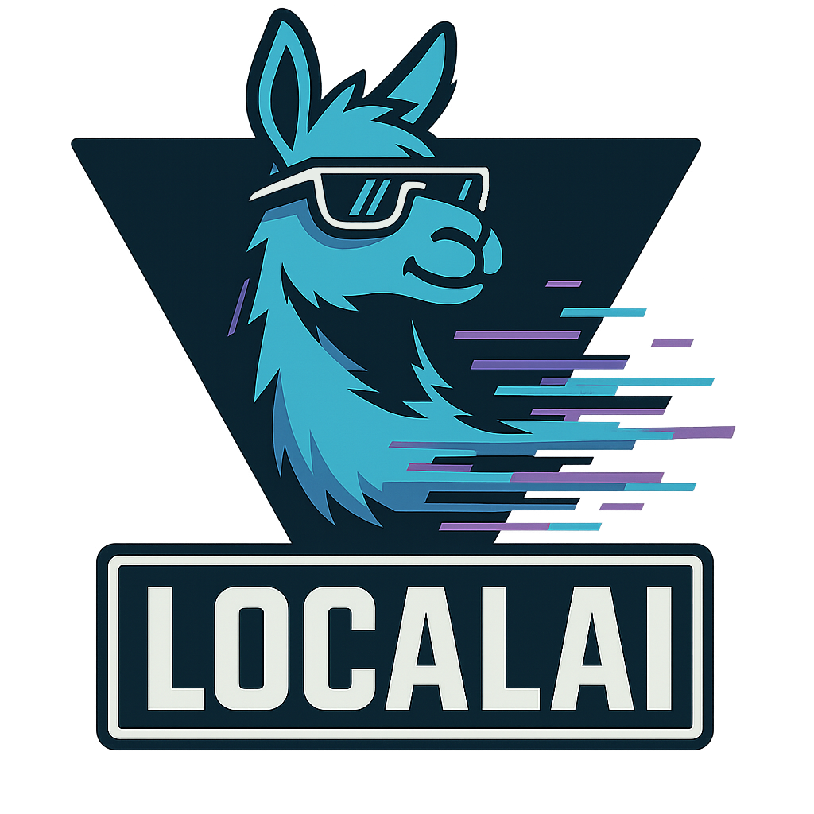

# AgentHub

<div align="center">
  <br>
  
  <br>
</div>

**AgentHub** is the agent configuration repository for LocalAI ecosystem. Browse, share, and discover agent configurations powered by [LocalAI](https://localai.io).

> 💡 Part of the [LocalAI](https://localai.io) family - The free, Open Source openAI alternative.

## 🚀 Quick Links

- **[LocalAI Website](https://localai.io)** - Main documentation and getting started guide
- **[AgentHub](https://agenthub.localai.io)** - Browse agent configurations
- **[LocalAI Documentation](https://localai.io/basics/getting_started/)** - Get started with LocalAI
- **[Models](https://models.localai.io)** - Discover available models

## 📚 About

AgentHub provides a curated collection of agent configurations that work seamlessly with LocalAI. Whether you're looking for planning agents, reasoning agents, or specialized AI assistants, you'll find them here.

### Features

- 🤖 Browse and discover agent configurations
- 🔍 Search by model, capability, or use case  
- 📥 Download and deploy agents instantly
- 🎨 Modern UI with LocalAI branding
- 🌙 Dark/light theme support

## 🏗️ Part of LocalAI Stack

AgentHub is part of the integrated LocalAI ecosystem:

- **[LocalAI](https://localai.io)** - Open Source OpenAI alternative for local AI inferencing
- **[LocalAGI](https://github.com/mudler/LocalAGI)** - AI agent orchestration platform
- **[LocalRecall](https://github.com/mudler/LocalRecall)** - MCP/REST API knowledge base system
- **[Cogito](https://github.com/mudler/cogito)** - Go library for intelligent agentic software
- **[Wiz](https://github.com/mudler/wiz)** - Terminal-based AI agent (Ctrl+Space)
- **[SkillServer](https://github.com/mudler/skillserver)** - Centralized skills database

## 🛠️ Usage

### Browse Agents

Visit [https://agenthub.localai.io](https://agenthub.localai.io) to browse available agents.

### Add Your Own Agent

1. Fork this repository
2. Add your agent configuration in the `agents/` directory
3. Create a Pull Request

### Development

```bash
# Serve locally
python -m http.server 8000

# Or use any static file server
```

## 🤝 Contributing

Contributions are welcome! Please feel free to submit a Pull Request.

1. Fork the repository
2. Create your feature branch (`git checkout -b feature/AmazingFeature`)
3. Commit your changes (`git commit -m 'Add some AmazingFeature'`)
4. Push to the branch (`git push origin feature/AmazingFeature`)
5. Open a Pull Request

## 📜 License

This project is licensed under the MIT License - see the [LICENSE](LICENSE) file for details.

## 🙏 Acknowledgments

- Built with love as part of the [LocalAI](https://localai.io) ecosystem
- Icons by [Font Awesome](https://fontawesome.com)
- Powered by [LocalAI](https://localai.io)

---

<div align="center">

[](https://localai.io)
[](https://discord.gg/uJAeKSAGDy)
[](https://twitter.com/LocalAI_API)

</div>
